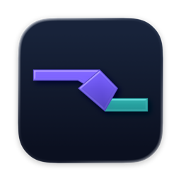
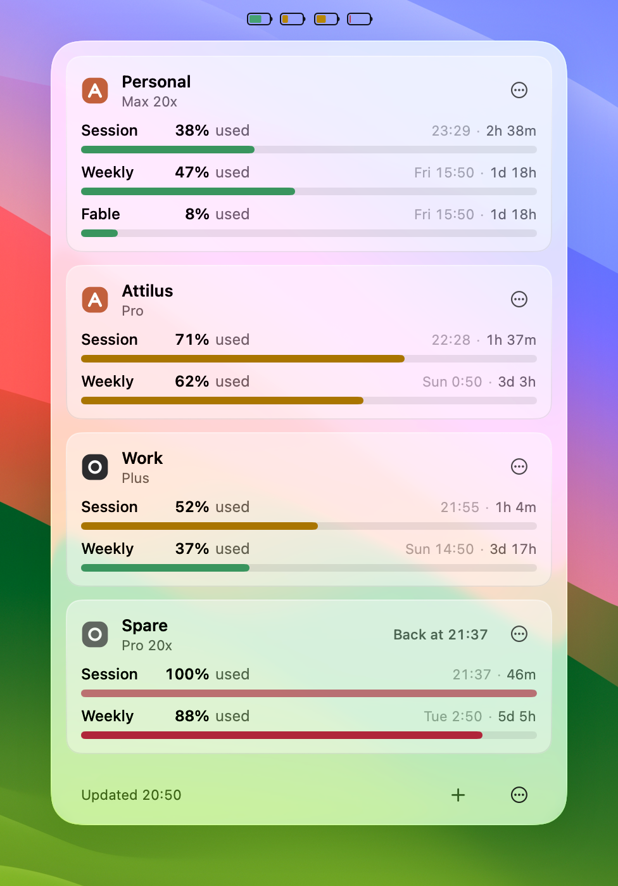
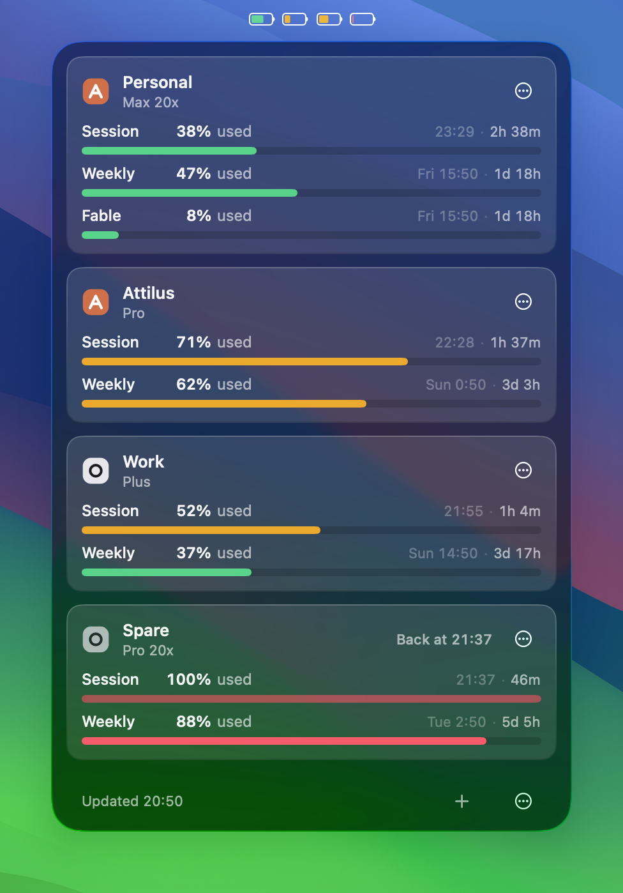

# QotaFolio



One Apple-style battery per AI account, on your Mac's menu bar.

The bar is what the current five-hour session still holds, and the colour is the same figure: green while more than half of it is there, amber as it gets low, red at a fifth or less — and a red hairline when there is nothing left of it. There is no number on the bar, because a battery is read without one. If you would rather budget by the week than by the session, **Settings → General → Menu bar** draws the batteries to the week instead, on exactly the same rule. Either way the bar is one window's own share and the words say both: hover, and each account reads *38% now · 53% this week*.

Click, and a panel drops from the batteries: your accounts as cards, in your order. Each card shows every window the provider reports, named as the provider names it — the percentage used, a level bar, and the reset as a live countdown beside an absolute time. Click a card and it opens into the instrument: the day so far as a line, and the projected end of the window with an honest range. The app shows; it never directs and it never acts.

| Light | Dark |
|---|---|
|  |  |

**Everywhere you look:** a Control for the menu bar or Control Center, a desktop widget with a ring per account, Spotlight ("check my quota" answers in place), and `qota status` in Terminal — every surface reading the same numbers from the same place. Alerts inform and never instruct. When your screen is shared, the batteries lose their colour and the panel hides your account names.

## Install

Download the app from the [latest release](https://github.com/c2coast/QotaFolio/releases/latest), double-click it, and drag QotaFolio to your Applications folder. The first time you open it, macOS asks once — *"QotaFolio" is an app downloaded from the internet. Are you sure you want to open it?* — and notes that Apple checked it. Click **Open**.

Then add an account: name it, pick the provider by its mark, sign in in your browser, and you are back with numbers in under a minute. Requires macOS 26.

## Your credentials

QotaFolio signs each account in with its own OAuth grant, scoped to reading usage, stored in its own Keychain item on your Mac. It never reads, copies, refreshes or touches another application's credentials, never spends quota or sends prompts, and nothing leaves your Mac — the only network traffic is your sign-in and the usage read itself, directly to the provider.

**A Claude account.** You sign in at claude.ai, in your own browser, through Anthropic's own OAuth flow. QotaFolio asks for that grant with the same public client identity Claude Code uses, holds it in its own Keychain item, refreshes it itself, and reads your usage from Anthropic's usage endpoint. Two things about that are worth knowing. Anthropic's [legal and compliance page for Claude Code](https://code.claude.com/docs/en/legal-and-compliance) says third-party developers may not offer Claude.ai login in their own applications, and may not collect, store or intermediate Claude.ai credentials — so this is a door Anthropic can close at any time. And that usage endpoint is the one third-party Claude usage monitors read; most of them read it with the token Claude Code already stored on your Mac, and QotaFolio does not. If the door closes, QotaFolio fails closed: the account shows **Needs sign-in** and stays there until a reviewed update.

A routine `codex login` elsewhere can invalidate QotaFolio's own ChatGPT grant; QotaFolio treats that as an ordinary reconnect. Some ChatGPT Enterprise workspaces disable device-code sign-in, and those accounts cannot be added.

## Removing your data

Use **Settings → General → Remove My Data…** before moving the app to the Trash, especially on a shared Mac. It deletes the sign-ins QotaFolio holds, your account list, your settings and its update files — for the current macOS user only. Your provider accounts are untouched: nothing is cancelled or deleted at Anthropic or OpenAI. QotaFolio then shows itself in Finder and quits, so you can drag it to the Trash.

## Trust

Releases are Developer ID-signed, notarized, stapled, and update through an EdDSA-signed Sparkle feed. The public update key ships in this repository; the private key does not. The quota endpoints are not documented public APIs and can change without notice; QotaFolio fails closed and waits for a reviewed update rather than silently changing hosts or schemas.

QotaFolio is an independent product and is not affiliated with, endorsed by, or sponsored by Anthropic or OpenAI.

## Build from source

You need macOS 26, Xcode 26 and [XcodeGen](https://github.com/yonaskolb/XcodeGen) (`brew install xcodegen`). To compile it:

```bash
xcodegen generate --no-env --spec project.yml --project . --project-root .
xcodebuild -project QotaFolio.xcodeproj -scheme QotaFolio -configuration Debug \
  -destination 'platform=macOS' CODE_SIGNING_ALLOWED=NO build
```

To *run* what you built you need an Apple Developer team, because the app, its widget and its `qota` command read one shared container whose name carries the team's identifier. Give yours on the same line and let it sign:

```bash
xcodebuild -project QotaFolio.xcodeproj -scheme QotaFolio -configuration Debug \
  -destination 'platform=macOS' DEVELOPMENT_TEAM=YOURTEAMID build
```

A Debug build is a different app to macOS on purpose — its own container, its own Keychain service, its own App Group — so a development build can never read or damage an installed QotaFolio's data. It also carries the fixture lab: launch it with `QOTAFOLIO_UI_SCENARIO=mixed` and the real app runs over invented accounts, holding no grant and reaching no network, which is how every picture on this page was taken. The header of [`FixtureAppRuntime.swift`](Sources/App/Composition/Fixture/FixtureAppRuntime.swift) lists the scenarios and every `QOTAFOLIO_UI_*` knob beside them.

The release lane is one script, [`Tools/release/ship.sh`](Tools/release/ship.sh); [`docs/release`](docs/release/README.md) explains what it does and why.

## Security reports

Do not put credentials or private account data in an issue. Report security matters through GitHub's private vulnerability reporting on this repository.

## License

MIT, © c2coast.
